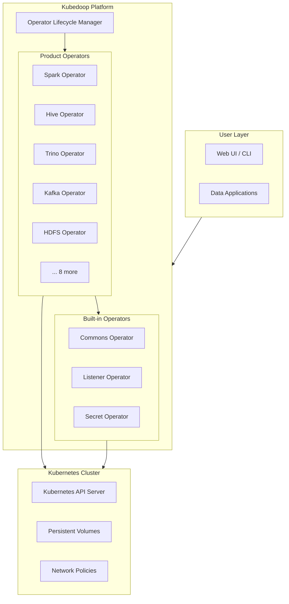
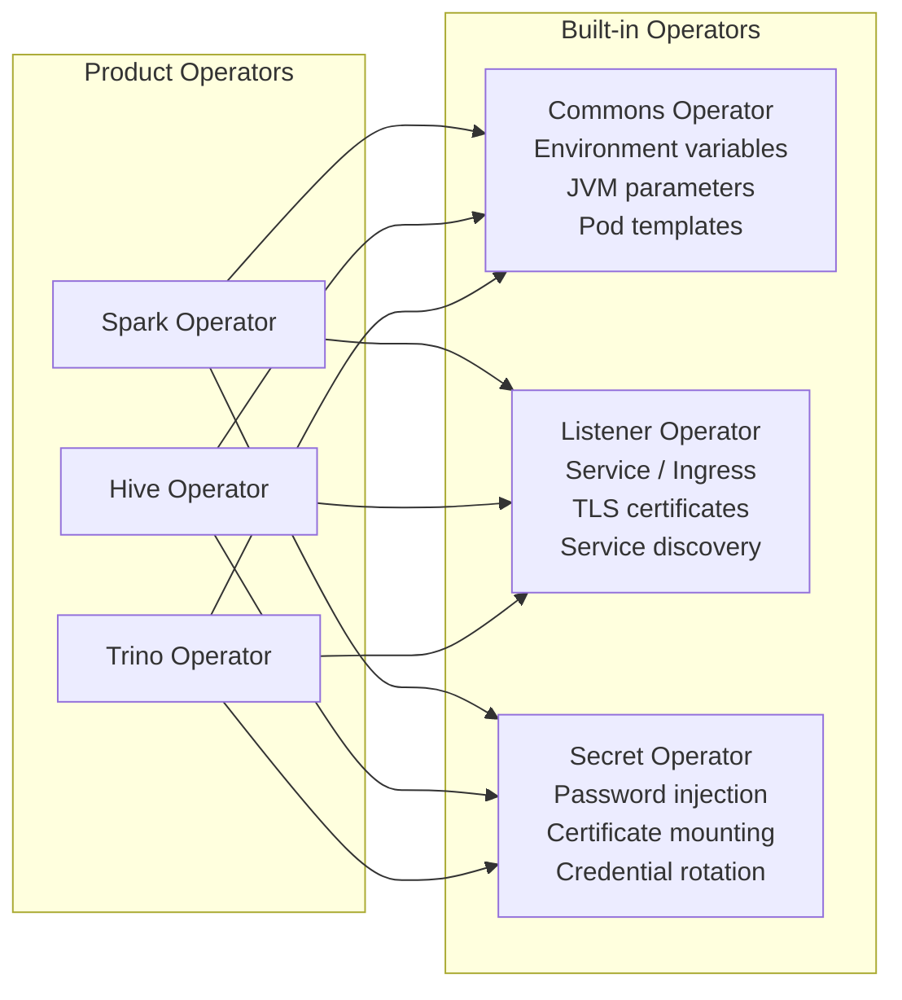
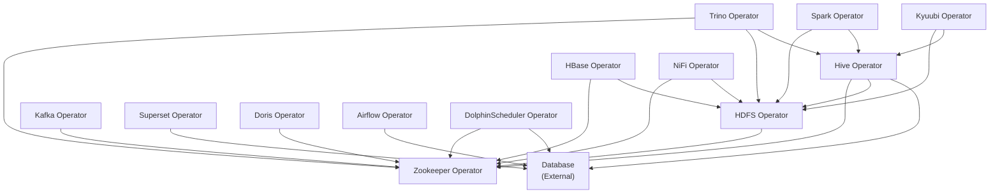
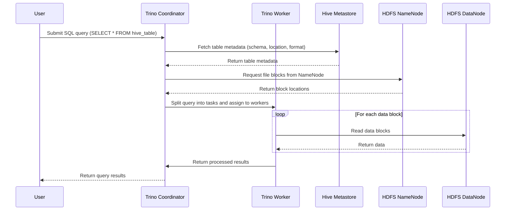

# Architecture

This document provides an overview of the Kubedoop Data Platform architecture, including its internal framework, built-in Operators, component dependencies, design principles, and data flow patterns.

## Platform Architecture Overview

Kubedoop is a Kubernetes-native DataOps platform that manages 15+ big data components through a unified Operator framework. The platform leverages the Operator Lifecycle Manager (OLM) for Operator installation and lifecycle management, running entirely on top of Kubernetes.



## operator-go Framework

All Kubedoop Operators are built on top of the **operator-go** framework, an in-house library that provides a unified abstraction for managing stateful data infrastructure on Kubernetes.

### Unified CRD Abstraction

The operator-go framework introduces a consistent CRD model across all Operators:

- **Cluster**: The top-level resource representing a full component deployment
- **Roles**: Logical groupings of processes with the same responsibility (e.g., NameNode, DataNode)
- **Role Groups**: Multiple instances of a role, allowing differentiated configurations for high availability, resource isolation, or workload separation

```yaml
apiVersion: {group}.kubedoop.dev/v1alpha1
kind: {ClusterKind}
metadata:
  name: my-cluster
spec:
  roleA:
    config:           # Role-level config
      resources:
        cpu: { min: "1" }
    roleGroups:
      group-1:        # Role group with default config
        replicas: 3
      group-2:        # Role group with overridden config
        replicas: 2
        config:
          resources:
            cpu: { min: "2" }
```

### Lifecycle Management

The operator-go framework handles the full lifecycle of component deployments:

| Phase | Description |
|-------|-------------|
| **Creation** | Deploys StatefulSets, Services, ConfigMaps, and Secrets based on CRD specs |
| **Scaling** | Adjusts replica counts for role groups without disrupting existing pods |
| **Upgrading** | Performs rolling upgrades across role groups with configurable maxUnavailable |
| **Failure Recovery** | Automatically restarts failed pods and reconciles desired vs. actual state |
| **Configuration Updates** | Applies config changes with graceful rolling restarts |

> Source code: [operator-go on GitHub](https://github.com/zncdatadev/operator-go)

## Built-in Operators

Kubedoop includes three built-in Operators that provide cross-cutting functionality shared by all product Operators:



### Commons Operator

The Commons Operator manages shared configuration that applies across all product Operators:

- **Environment variables**: Injects common environment variables into component pods
- **JVM parameters**: Configures JVM heap size, GC settings, and other Java runtime options
- **Pod templates**: Provides a base Pod template (annotations, labels, affinity) that product Operators extend

### Listener Operator

The Listener Operator provides automated service discovery and network configuration:

- **Service / Ingress generation**: Automatically creates Kubernetes Services and Ingress resources based on listener definitions
- **TLS certificate management**: Provisions and rotates TLS certificates for encrypted communication
- **Service discovery**: Enables components to discover each other through DNS and built-in service resolution

### Secret Operator

The Secret Operator handles secure credential management:

- **Password injection**: Automatically generates and injects passwords into component pods as environment variables or files
- **Certificate mounting**: Mounts TLS certificates and keys into pods from centralized Secret resources
- **Credential rotation**: Supports periodic rotation of credentials without manual intervention

## Component Dependencies

The following diagram shows the dependency relationships between Kubedoop product Operators:



| Operator | Dependencies |
|----------|-------------|
| Zookeeper | None (foundational service) |
| HDFS | Zookeeper |
| Hive | Zookeeper, HDFS, Database |
| Trino | Zookeeper, HDFS, Hive |
| Spark | HDFS, Hive |
| Kafka | Zookeeper |
| Superset | Database |
| Doris | Zookeeper |
| HBase | Zookeeper, HDFS |
| Kyuubi | HDFS, Hive |
| NiFi | Zookeeper, HDFS |
| Airflow | Database |
| DolphinScheduler | Zookeeper, Database |

## Design Principles

Kubedoop is built on the following core design principles:

### Kubernetes Native

All components are managed through Kubernetes Custom Resource Definitions (CRDs) and Operators. There are no custom orchestration layers — the platform relies entirely on the Kubernetes API for state management, scheduling, and self-healing.

### Declarative Configuration

Users describe the *desired state* of their data infrastructure through YAML manifests. The Operators continuously reconcile the actual state with the desired state, ensuring consistency without manual intervention.

### Pluggable Storage

Storage is abstracted through Kubernetes StorageClass, allowing users to choose the underlying storage backend (SSD, HDD, NFS, cloud storage) without changing their component configuration. This enables flexible deployment across different environments.

### Unified Security Model

All Operators share a consistent security model through the built-in Secret Operator and Listener Operator. TLS encryption, authentication, and credential management are handled uniformly across all components.

### Observability

Kubedoop provides built-in observability for all managed components:

- **Logging**: Centralized log collection and management
- **Metrics**: Exposed through Prometheus-compatible endpoints
- **Alerting**: Integration with alerting systems for proactive monitoring

## Data Flow Example

The following sequence diagram illustrates the data flow when a user submits a SQL query through Trino to read data from Hive:



This flow demonstrates how Kubedoop's component Operators work together:

1. **Trino** receives the query and coordinates execution
2. **Hive Metastore** provides table schema and data location metadata
3. **HDFS NameNode** manages the file system namespace and block locations
4. **HDFS DataNodes** serve the actual data blocks to Trino Workers
5. **Trino Workers** process the data in parallel and return results
