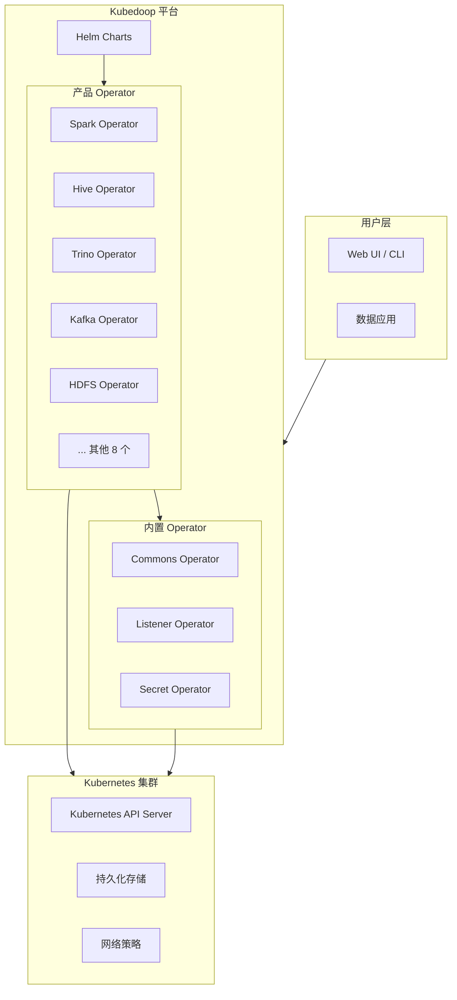
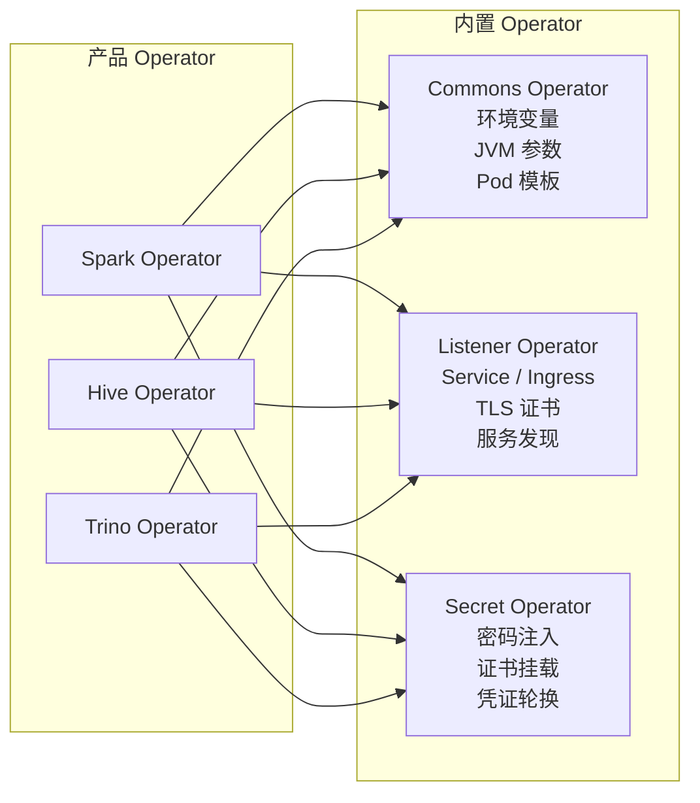
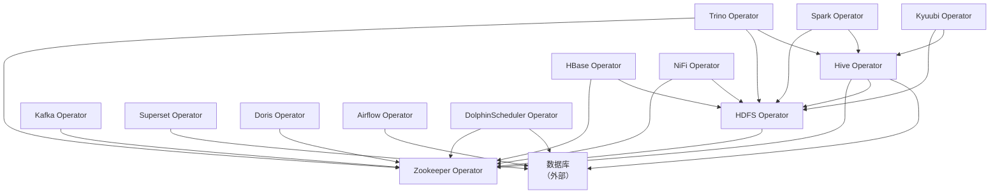
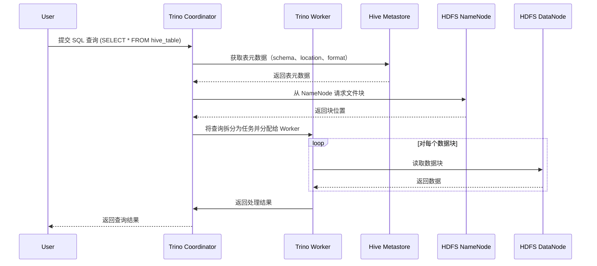

# 架构

本文档概述了 Kubedoop 数据平台的架构，包括内部框架、内置 Operator、
组件依赖关系、设计原则和数据流模式。

## 平台架构概览

Kubedoop 是一个 Kubernetes 原生的 DataOps 平台，通过统一的 Operator 框架
管理 15+ 个大数据组件。平台使用 Helm Chart 进行 Operator 的安装和生命周期管理，
完全运行在 Kubernetes 之上。



## operator-go 框架

所有 Kubedoop Operator 都构建在 **operator-go** 框架之上，
这是一个自研库，为在 Kubernetes 上管理有状态数据基础设施提供统一抽象。

### 统一的 CRD 抽象

operator-go 框架在所有 Operator 中引入了一致的 CRD 模型：

- **Cluster**：表示完整组件部署的顶层资源
- **Roles**：具有相同职责的进程逻辑分组（如 NameNode、DataNode）
- **Role Groups**：一个角色的多个实例，允许通过不同配置实现高可用、资源隔离或负载分离

```yaml
apiVersion: {group}.kubedoop.dev/v1alpha1
kind: {ClusterKind}
metadata:
  name: my-cluster
spec:
  roleA:
    config:           # 角色级别配置
      resources:
        cpu: { min: "1" }
    roleGroups:
      group-1:        # 使用默认配置的角色组
        replicas: 3
      group-2:        # 使用覆盖配置的角色组
        replicas: 2
        config:
          resources:
            cpu: { min: "2" }
```

### 生命周期管理

operator-go 框架处理组件部署的完整生命周期：

| 阶段 | 描述 |
|------|------|
| **创建** | 根据 CRD 规范部署 StatefulSet、Service、ConfigMap 和 Secret |
| **扩缩容** | 调整角色组的副本数，不中断现有 Pod |
| **升级** | 在角色组之间执行滚动升级，支持配置 maxUnavailable |
| **故障恢复** | 自动重启失败的 Pod，协调期望状态与实际状态 |
| **配置更新** | 通过优雅的滚动重启应用配置变更 |

> 源代码：[operator-go GitHub](https://github.com/zncdatadev/operator-go)

## 内置 Operator

Kubedoop 包含三个内置 Operator，为所有产品 Operator 提供共享的跨切面功能：



### Commons Operator

Commons Operator 管理所有产品 Operator 共享的配置：

- **环境变量**：向组件 Pod 注入通用环境变量
- **JVM 参数**：配置 JVM 堆大小、GC 设置和其他 Java 运行时选项
- **Pod 模板**：提供基础 Pod 模板（注解、标签、亲和性），产品 Operator 可扩展

### Listener Operator

Listener Operator 提供自动化的服务发现和网络配置：

- **Service / Ingress 生成**：根据监听器定义自动创建 Kubernetes Service 和 Ingress 资源
- **TLS 证书管理**：配置和轮换 TLS 证书，支持加密通信
- **服务发现**：通过 DNS 和内置服务解析使组件能够互相发现

### Secret Operator

Secret Operator 处理安全的凭证管理：

- **密码注入**：自动生成密码并以环境变量或文件形式注入到组件 Pod
- **证书挂载**：从集中式 Secret 资源将 TLS 证书和密钥挂载到 Pod
- **凭证轮换**：支持定期轮换凭证，无需人工干预

## 组件依赖关系

下图展示了 Kubedoop 产品 Operator 之间的依赖关系：



| Operator | 依赖 |
|----------|------|
| Zookeeper | 无（基础服务） |
| HDFS | Zookeeper |
| Hive | Zookeeper、HDFS、数据库 |
| Trino | Zookeeper、HDFS、Hive |
| Spark | HDFS、Hive |
| Kafka | Zookeeper |
| Superset | 数据库 |
| Doris | Zookeeper |
| HBase | Zookeeper、HDFS |
| Kyuubi | HDFS、Hive |
| NiFi | Zookeeper、HDFS |
| Airflow | 数据库 |
| DolphinScheduler | Zookeeper、数据库 |

## 设计原则

Kubedoop 基于以下核心设计原则构建：

### Kubernetes 原生

所有组件通过 Kubernetes 自定义资源定义（CRD）和 Operator 进行管理。
没有自定义编排层 —— 平台完全依赖 Kubernetes API 进行状态管理、调度和自愈。

### 声明式配置

用户通过 YAML 清单描述数据基础设施的*期望状态*。
Operator 持续协调实际状态与期望状态，确保一致性而无需人工干预。

### 可插拔存储

存储通过 Kubernetes StorageClass 抽象，允许用户选择底层存储后端
（SSD、HDD、NFS、云存储），而无需更改组件配置。
这使平台能够在不同环境中灵活部署。

### 统一安全模型

所有 Operator 通过内置的 Secret Operator 和 Listener Operator
共享一致的安全模型。TLS 加密、认证和凭证管理在所有组件中统一处理。

### 可观测性

Kubedoop 为所有托管组件提供内置的可观测性：

- **日志**：集中式日志收集和管理
- **指标**：通过 Prometheus 兼容端点暴露
- **告警**：与告警系统集成，支持主动监控

## 数据流示例

以下时序图展示了用户通过 Trino 提交 SQL 查询读取 Hive 数据时的数据流：



此流程展示了 Kubedoop 的组件 Operator 如何协同工作：

1. **Trino** 接收查询并协调执行
2. **Hive Metastore** 提供表结构和数据位置元数据
3. **HDFS NameNode** 管理文件系统命名空间和块位置
4. **HDFS DataNode** 向 Trino Worker 提供实际数据块
5. **Trino Worker** 并行处理数据并返回结果
